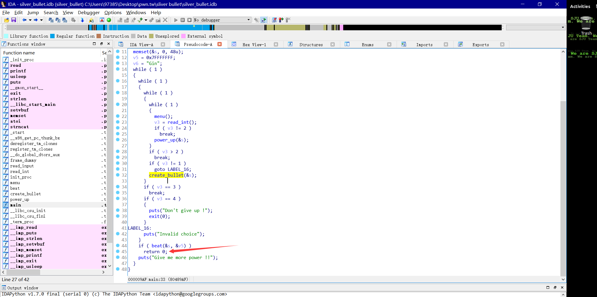
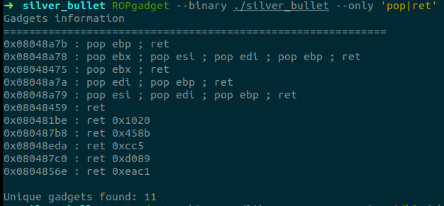

# silver_bullet -- 白板off-by-one漏洞利用
这道题也是pwnable.tw上的一道200分的选单程序题，题目很有意思是一个打狼人的游戏，创造一把枪然后根据用户输入的长度给枪充能，然后去打死狼人。//md语文水平太烂了，讲句话都讲不好。
选单程序咩，先把逻辑分析清楚，看下各个函数。
```
int menu()
{
  puts("+++++++++++++++++++++++++++");
  puts("       Silver Bullet       ");
  puts("+++++++++++++++++++++++++++");
  puts(" 1. Create a Silver Bullet ");
  puts(" 2. Power up Silver Bullet ");
  puts(" 3. Beat the Werewolf      ");
  puts(" 4. Return                 ");
  puts("+++++++++++++++++++++++++++");
  return printf("Your choice :");
}
```
首先是菜单，显示给用户选项。  
然后是creatbullet函数，初始化银枪并充能。  
之后是powerup函数，主要功能是通过将新输入的字符串与初始化时的字符串`strcat`连接起来，并计算新的字符串的长度判断是否超过48，如果超过，就输出无法充能,之后更新银枪能量。  
最后是beat函数，用银枪去打狼人，如果狼人hp为0就退出main函数。  
  
利用思路：  
createbullet先输入47个字符进缓冲区,之后进行一次powerup，只输入1个字节，因为输入的是字符串，而且使用的是`'strcat'`函数,所以输入刚好凑齐48字节，最后的`'\0'`会将缓冲区的下一个字节覆盖，通过gdb调试可以发现缓冲区的下面一个字节存放的是字符串长度,`\0`刚好可以将len覆盖，这样我们就能通过powerup函数扩充栈然后构造输入溢出(第二次的powerup能输入47个字节，足够将将ebp后四位覆盖了)并将main函数返回地址覆盖,由于这里没有像hacknote那样的任意命令执行，考虑ret2libc，通过覆盖返回地址构造rop链最后执行`system('/bin/sh')`来getshell，程序中有printf的plt地址，第一次可以将返回地址构造成printf函数调用的地址，由于这里无法使用栈存放参数，所以利用`pop ebx`指令将参数放进ebx供printf调用，然后将返回地址设置为main函数起始地址，之后就是再来一次上面的操作，ret2libc执行system调用getshell。
嗯呐就是这样啦，网上看了下教程好像说大多数的off-by-one都是用来扩充栈容量然后给攻击者溢出的，反正这次mark啦。还有就是找rop链，有个工具叫ropgadget，还是很好用的(`ROPgadget --binary ./silver_bullet --only 'pop|ret'`用来找pop ebx，ret;`ROPgadget --binary ./libc_32.so.6  --string '/bin/sh'`用来找`/bin/sh`字符串)。  
嗯呐大体就是这样子的。这算是个白板off-by-one了吧。